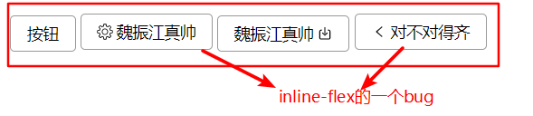
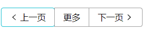
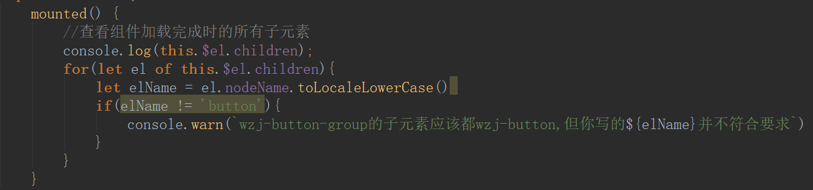
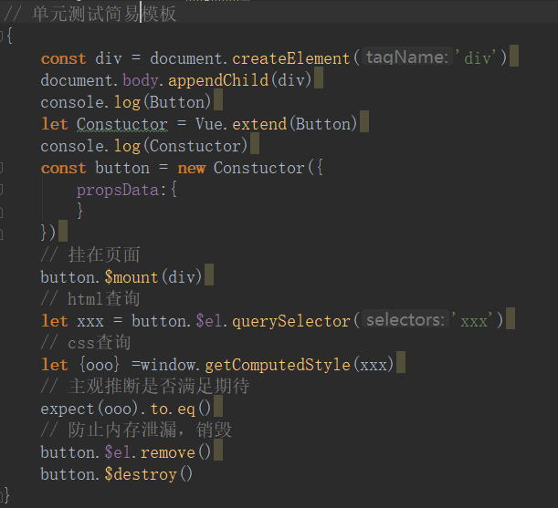

# WZJ_Wheels

## 一、初始化

```
1、配置MIT协议，Create a file输入License然后顺序操作
2、npm init配置包信息
3、安装vue
```

## 二、Webstrom使用小技巧

### 2.1、VCS（version control system）

### 2.2、基础配置

```
1、settings--keymap--ctrl+G
2、创建gitignore配置无需提交项
3、设置origin
4、settings--搜索unsign--勾选allow unsigned requests
```

## 三、样式设置

### 3.1、使用scss，使用css变量

```
:root{    // 设置变量
    --button-height:32px;
    --font-siez:14px;
    --button-bg: #fff;
    --button-active-bg:#eee;
    --border-radius: 4px;
    --color:#999;
    --border-color:#999;
    --border-color-hover: #666;
   }
使用时 var（--button-height）
```

## 四、parcel简易打包

```
1、npm install -g parcel-bundler
2、vue官网配置parcel
"alias": {
    "vue" : "./node_modules/vue/dist/vue.common.js"
  }
3、打包时禁止缓存
parcel index.html --no--cache
4、如果热加载失败请查看parcel中safe write
5、gitignore失效解决办法git rm -r --cached .
```

## 五、按钮组件设计

### 5.1、需求分析

```
1、用户可以根据属性icon控制图片样式
2、用户可以根据iconPosition控制图标位置
3、用户点击时候加载lodding
4、按钮组
```

### 5.2、需求1实现思路

```
1、创建button和icon组件
2、通过属性icon设置传入icon名字，判断icon状态显示svg
3、通过slot设置按钮文字内容
```

### 5.3、需求2实现思路

```
1、通过切换class，改变flex-order实现改变图标位置
2、通过props校验设置默认值解决undefined问题，通过validator解决用户传入错误问题
```

### 5.4 、需求1,2BUG解决



```
解决办法：给button设置vertical-align: middle;
```

### 5.5、需求3实现思路

```
1、通过属性loddingStatus切换正在加载状态
2、点击切换loddingStatus状态实现正在加载和图标切换实现
```

### 5.6、需求4实现思路

```
1、创建button-group组件，通过slot接受button并进行组合
2、通过first-child,last-child解决圆角问题
3、通过margin-left:-1px;和z-index:1解决鼠标经过状态问题
```

### 5.7、需求3，4BUG解决



**解决办法**

在组件加载完成做一个判断，查看是否有非wzj-button元素并给与警告



### 5.8、单闭合标签bug

使用单闭合标签，后面的内容不显示。

原因：**Vue使用的是Html语法，单闭合标签是XML语法。自定义组件按照Html语法解析！**

解决办法：**使用自定义组件时，需要使用双标签写法**

## 六、单元测试和mock

### 6.1、单元测试依赖

```
npm i -D chai
npm i -D chai-spies
```

### 6.2、单元测试简易模板



## 七、Toast组件

### 7.1、需求分析

```
1、弹出Toast--自动关闭--点击关闭--操作回调

```


